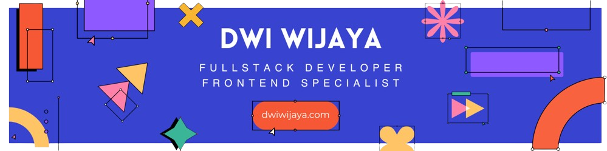

```javascript
const Dwiwijaya = {

    username: 'dwi-wijaya',
    name: 'Dwi Wijaya',
    position: 'Fullstack Developer',
    web: 'https://dwiwijaya.com',
    links: 'https://mylinks-app.vercel.app/dwiwijaya',
    cv: 'https://bit.ly/cv-dwiwijaya',
    linkedin: 'https://linkedin.com/in/dwi-wijaya',
    mail: 'work.dwiwijaya@gmail.com',
    code: {
        backend: ['PHP', 'Codeigniter', 'Yii2', 'NodeJS'],
        database: ['PostgreSQL', 'MySQL', 'Oracle', 'MongoDB'],
        frontend: ['HTML', 'CSS', 'JS', 'Jquery', 'ReactJS', 'Vue.js', 'Next.js', 'Bootstrap', 'Tailwind', 'Sass'],
        tools: ['GIT', 'GitHub', 'GitLab', 'Lighthouse', 'Ngrok', 'Dbeaver'],
        misc: ['Firebase', 'SCRUM', 'SOLID', 'PWA']
    },
    architecture: ['SPA', 'MVC'],
    currentlylearning: ['Vue.js', 'Nuxt.js'],

    toString: function() {
        return `${this.name} | ${this.position}`;
    }

};

console.log(Dwiwijaya.toString());
```

## Get in touch

- Personal Site: https://dwiwijaya.com
- Links: https://mylinks-app.vercel.app/dwiwijaya
- CV Resume: https://bit.ly/cv-dwiwijaya
- Mail: work.dwiwijaya@gmail.com

[](https://visitcount.itsvg.in)
