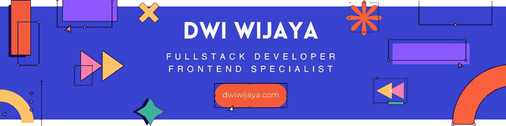

---

```javascript
class Dwiwijaya {
    constructor() {
        this.username = 'dwi-wijaya';
        this.name = 'Dwi Wijaya';
        this.position = 'Full-stack Web Developer';
        this.web = 'https://dwiwijaya.com';
        this.links = 'https://mylinks-app.vercel.app/dwiwijaya';
        this.cv = 'https://bit.ly/cv-dwiwijaya';
        this.linkedin = 'https://linkedin.com/in/dwi-wijaya';
        this.email = 'hello@dwiwijaya.com';
        this.skills = {
            languages: ['PHP', 'JavaScript', 'TypeScript'],
            backend: ['CodeIgniter', 'Yii2', 'Node.js', 'RESTful APIs', 'GraphQL'],
            database: ['PostgreSQL', 'MySQL', 'Oracle', 'MongoDB'],
            frontend: ['HTML', 'CSS', 'JavaScript', 'jQuery', 'React.js', 'Vue.js', 'Next.js', 'Bootstrap', 'Tailwind', 'Sass'],
            tools: ['Git', 'GitHub', 'GitLab', 'Lighthouse', 'Ngrok', 'DBeaver', 'Vercel', 'Firebase', 'Supabase'],
            methodologies: ['SCRUM', 'SOLID'],
            architecture: ['SPA', 'PWA', 'MVC', 'Monolithic', 'RESTful'],
        };
        this.currentlyLearning = ['Vue.js', 'Nuxt.js'];
    }

    getProfile() {
        return `${this.name} | ${this.position}`;
    }
}

const dwiwijaya = new Dwiwijaya();
console.log(dwiwijaya.getProfile());

```

## Get in touch 🌐

- Personal Site: https://dwiwijaya.com
- Links: https://mylinks-app.vercel.app/dwiwijaya
- CV Resume: https://bit.ly/cv-dwiwijaya
- Email: hello@dwiwijaya.com 
- Linked-in: https://linkedin.com/in/dwi-wijaya <br>

[](https://visitcount.itsvg.in)
